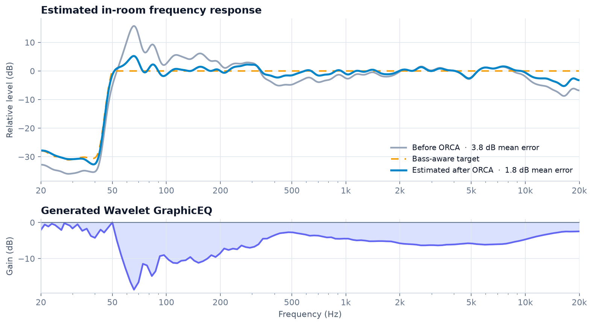

# ORCA

**Turn Room EQ Wizard measurements into a ready-to-import GraphicEQ room-correction filter.**

[](https://github.com/LukasB97/ORCA/actions/workflows/tests.yml)

[](LICENSE)

ORCA takes one or more frequency-response measurements exported from
[Room EQ Wizard (REW)](https://www.roomeqwizard.com/), calculates a correction curve, and
outputs a `GraphicEQ` definition for software equalizers such as
[Wavelet](https://pittvandewitt.github.io/Wavelet/) and
[Equalizer APO](https://sourceforge.net/projects/equalizerapo/).

Unlike workflows built around a small set of parametric filters, ORCA optimizes the actual
GraphicEQ control points that will be exported. The result can follow room-response problems in
detail while becoming progressively smoother toward higher frequencies.



## Why ORCA?

- **Go from measurements to an importable filter.** Point ORCA at a directory of REW exports and
  receive a complete `GraphicEQ:` definition on standard output.
- **Correct the listening area, not only one microphone position.** ORCA level-aligns and combines
  multiple measurements before optimizing the filter.
- **Avoid unrealistic bass boost.** The target automatically follows the measured low-frequency
  roll-off where correction would otherwise cost headroom and increase distortion.
- **Choose the output you need.** Use the default 128-point layout, the more detailed 256-point
  layout, Wavelet's fixed frequency grid, or your own control points and target curve.
- **See what changed.** Optional diagnostics compare the original and estimated corrected response
  without contaminating the exported GraphicEQ output.

## How it works

1. Measure the loudspeaker at one or more listening positions in REW.
2. Export every frequency response as a text file and run ORCA on the files.
3. Save the generated `GraphicEQ` line and import it into Wavelet, Equalizer APO, or another
   compatible equalizer.

## Quick start

### 1. Export measurements from REW

In REW, export each measurement as a text file containing frequency and SPL columns. Put the
exports in one directory. All measurements must use the same frequency grid.

### 2. Install ORCA

Install the current version directly from GitHub:

```console
python -m pip install "orca @ git+https://github.com/LukasB97/ORCA.git"
```

Or install an editable checkout:

```console
git clone https://github.com/LukasB97/ORCA.git
cd ORCA
python -m pip install -e .
```

ORCA requires Python 3.9 or newer.

### 3. Generate a filter

For Wavelet, select its fixed GraphicEQ frequency layout and write the result to a file:

```console
orca-eq --measurements-dir "path/to/rew-exports" --config wavelet > GraphicEQ.txt
```

For the default 128-point layout:

```console
orca-eq --measurements-dir "path/to/rew-exports" > GraphicEQ.txt
```

The generated file contains one line in this format:

```text
GraphicEQ: 20 -2.1; 21 -0.6; 22 -1.1; ...; 18812 -2.5; 19871 -2.5
```

From a checkout, you can try ORCA immediately with the included measurements:

```console
orca-eq --measurements-dir "example measurements" --config wavelet --verbose > GraphicEQ.txt
```

`--verbose` prints the level-aligned mean absolute deviation and its 95th percentile to standard
error. Standard output remains a clean GraphicEQ definition, so redirecting it to a file is safe.

## Python API

Generate a Wavelet-compatible filter and save it:

```python
from pathlib import Path

from orca import get_graph_eq_str, wavelet_config

graphic_eq = get_graph_eq_str(
    measurements_dir="path/to/rew-exports",
    eq_config=wavelet_config(),
)
Path("GraphicEQ.txt").write_text(graphic_eq + "\n", encoding="utf-8")
```

You can also pass individual files:

```python
from orca import get_graph_eq_str

graphic_eq = get_graph_eq_str(
    file_paths=[
        "measurements/left.txt",
        "measurements/center.txt",
        "measurements/right.txt",
    ]
)
```

### Choose a target curve

The default target is flat. Built-in alternatives include downward-sloping targets, a downward
slope with a flatter upper-mid section, and a V-shaped target:

```python
from orca import TargetCurves, get_graph_eq_str

graphic_eq = get_graph_eq_str(
    measurements_dir="path/to/rew-exports",
    target_curve=TargetCurves.downwards_slope(factor=0.5),
)
```

A target is a regular `Curve`, so applications can also construct their own target shape.

### Configure the GraphicEQ grid

Use `EQConfig.from_range()` for a logarithmically spaced custom grid:

```python
from orca import get_graph_eq_str
from orca.EQConfig import EQConfig

config = EQConfig.from_range(eq_from=30, eq_to=18_000, eq_res=256)
graphic_eq = get_graph_eq_str(
    measurements_dir="path/to/rew-exports",
    eq_config=config,
)
```

The main configuration options are:

| Option | Default | Purpose |
| --- | ---: | --- |
| `eq_points` | 128 points, 20–20,000 Hz | Exact GraphicEQ control frequencies |
| `set_max_zero` | `True` | Shifts the complete EQ so its highest gain is 0 dB |
| `max_boost` | `10.0` dB | Boost ceiling when `set_max_zero=False` |
| `weighting_fun` | frequency-dependent smoothing | Controls how strongly each optimization pass changes the EQ |

`format_eq_str(eq_curve)` preserves a curve's existing control points. Pass a configuration as
`format_eq_str(eq_curve, config=config)` to resample the curve and apply that configuration's output
constraints.

### Correct a limited frequency range

For a band-limited measurement, choose both the EQ range and the frequency range used for SPL
normalization:

```python
from orca import get_graph_eq_str
from orca.EQConfig import EQConfig

subwoofer_config = EQConfig.from_range(eq_from=20, eq_to=80, eq_res=32)
graphic_eq = get_graph_eq_str(
    measurements_dir="path/to/subwoofer-measurements",
    eq_config=subwoofer_config,
    reference_range=(30, 80),
)
```

The equivalent CLI command is:

```console
orca-eq --measurements-dir "path/to/subwoofer-measurements" \
  --eq-from 20 --eq-to 80 --eq-res 32 \
  --reference-from 30 --reference-to 80 > SubwooferEQ.txt
```

## CLI reference

| Option | Description |
| --- | --- |
| `--measurements-dir DIR` | Read every `.txt` measurement in a directory |
| `--file FILE` | Read one measurement; repeat the option for multiple files |
| `--config default\|detail\|wavelet` | Select the 128-point, 256-point, or Wavelet layout |
| `--eq-from`, `--eq-to`, `--eq-res` | Build a custom logarithmic control-point grid |
| `--reference-from`, `--reference-to` | Change the SPL normalization range |
| `--verbose` | Print before/after error estimates to standard error |
| `--draw` | Show diagnostic plots; requires the optional plotting dependency |

From a checkout, install plotting support with:

```console
python -m pip install -e ".[plot]"
```

The same CLI is available through `python -m orca` and `python -m orca.cli`.

## What ORCA does

ORCA first normalizes every measurement against their shared 100–10,000 Hz range. This gives the
measurements a common playback level without allowing bass roll-off, room modes, or high-frequency
directivity to dominate the reference. For band-limited measurements, use `reference_range` or the
matching CLI options instead.

It then:

1. combines the normalized measurements into an average in-room response;
2. adapts the low-frequency target where achieving the requested curve would require excessive
   boost;
3. optimizes the configured GraphicEQ control-point gains over several passes, from strongly
   smoothed measurements to the original unsmoothed data;
4. evaluates every candidate EQ on the measurements' native frequency grid; and
5. estimates the response produced by applying the exported, finite-resolution GraphicEQ curve.

Later passes and higher frequencies receive smaller changes. This is what makes the generated EQ
progressively smoother toward high frequencies. A custom weighting function can change that
behavior.

## Measurement requirements and expectations

- Every input must be a readable REW text export with positive frequency values and SPL data.
- All measurements must use the same frequency grid.
- Every measurement must fully cover the selected SPL reference range.
- ORCA preserves positive measurement frequencies outside the default 20–20,000 Hz EQ range, while
  exporting only the configured GraphicEQ control points.
- The corrected response is an estimate. Measure the system again after applying the filter to
  verify the result at the intended listening positions.
- Digital equalization cannot repair deep acoustic nulls, excessive reverberation, poor speaker
  placement, or a loudspeaker operating beyond its physical limits.

## Development

Install the development dependencies and run all checks from the repository root:

```console
python -m pip install -e ".[dev]"
python -m unittest discover -v
python -m ruff check .
python -m ruff format --check .
python -m mypy
```

To regenerate the README overview image from the included REW exports, install plotting support
separately and run the generator:

```console
python -m pip install -e ".[plot]"
python docs/generate_readme_assets.py
```

Additional Python examples are available in [`examples.py`](examples.py).

## License

ORCA is available under the [MIT License](LICENSE).
